# COMP 1828 - Designing, developing and testing solutions for the London Underground system
### Team members:
- Tristan Read (ID: `001151378`)

## Justification of the choice of the data structures and algorithms
###### (max 1 page) [10 marks]
For my construction of a graph, I have decided to use an OOP based approach, this is for a few reasons.  
A graph in my program is a collection of nodes and edges, each as their own separate object. My nodes contain an adjacency dictionary who's keys are the neighboring node IDs and values are another dictionary of edge IDs and edges. The adjacency dict is multi-dimensional because I needed to have support for multigraphs, where one node can have many edges to the same neighbor.  
The graph object contains a dictionary of nodes and another dictionary of edges. The nodes dictionary is used to store the nodes in the graph, and the edges dictionary is used to store the edges in the graph with their source and destination nodes.  

## Critical evaluation of the performance of the data structures and algorithms used
###### (max 2 pages) [20 marks]
The reason behind me using dictionaries for everything is that while they may take a bit longer to index and use a bit more memory is, overall they are faster and more reliable because if I were to add a new node, I would not have to resize the entire array. The story is similar for removing an item, but you also don't have to update all of your array indexers, by giving each element their own ID, you can always index that same elements info no matter what modifications are made to the dictionary. This is as opposed to if you had an array where you would also have to keep track of all of the elements if you needed to index them again.  
My choice of algorithm for the primary task was to use Dijkstra's algorithm. The reason I picked this algorithm is because it was the one that I understood the best by myself (without looking at external code resources). While this is a "greedy" algorithm, meaning it will not follow the shortest path for every search it makes, it is still fast and reliable enough for this application.  
For task 3, I decided implement the dynamic programming variant of the Bellman Ford algorithm, this algorithm is not greedy and follows the shortest path every iteration. In my implementation of Dijkstra's algorithm, I had made an optimization where I would return the result once the end node was boxed. I was unable to implement this into the Bellman Ford algorithm because it would end up throwing off the negative cycle detection.  

## Discussion for the choice of test data you provide and a table detailing the tests performed
###### (max 2 pages) [10 marks]
`Summary` Discuss my JSON data structure and why I choose it.  
Before writing this Python program and after I had settled on a data structure for the internal program, I decided to write a csx (C#) script that would convert the provided csv tubemap data file to a JSON file. The json structure that I had created is similar to what is used in the internal program however it utilizes more lists than dictionaries, as if I were to make a 1:1 copy of the internal program's data structure, it would result in an infinite recursion loop because of how I store values by reference on the nodes.  
For example in the internal program I store the node ID and node reference in the dictionary, but the resulting json file would only store the node ID, which when loaded back into the program would be used to build a new node object to be added to a graph.  
For my test data I created some simple graphs that I could figure the result of in my head with ease as well as one example from the lecture slides, I then compared this against the programs result using the various algorithms I had implemented.  

### Graph searcher tests:
In this test I check to see if a graph is connected or not.  

### Pathfinder algorithm tests:
In this test I check to see if the pathfinder algorithms are working correctly against two known graphs.  
Below are the two graphs used for testing:  
| Graph 1 | Graph 2 |
| --- | --- |
| 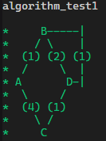 | 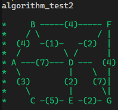 |

#### Dijkstra's algorithm:
| Graph 1 |
| --- |
| 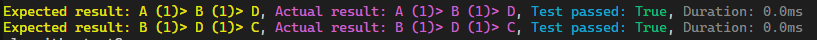

| Graph 2 |
| --- |
| 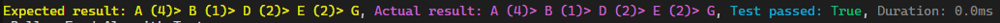

#### Bellman Ford algorithm:
| Graph 1 |
| --- |
| 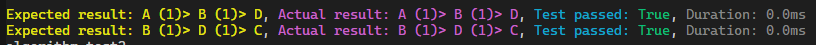

| Graph 2 |
| --- |
| 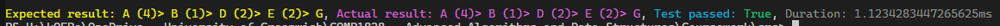

## Screen-captured demonstration of your working source code
###### (max 3 pages) [20 marks]

### Task 1a:
Task 1a asked us to calculate and display the shortest path between two nodes.  
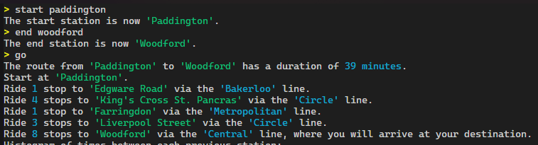

### Task 1b:
Task 1b asked us to show a histogram of the time between each station in the path.  
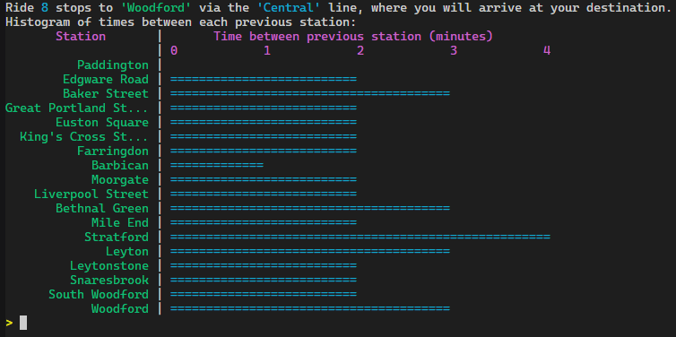

### Task 2a:
Task 2a tasked us with being able to close a line, and denying closure if it is not feasible.  
Here I am closing the line between `Woodford` and `Roding Valley` via the `Central` line. This closure is accepted because it does not disconnect the graph.  
However when I try to close the line between `Leystone` and `Wanstead` via the `Central` line, the closure is denied because it would disconnect the graph because all stations between `Roding Valley` and `Wanstead` would be unreachable.  
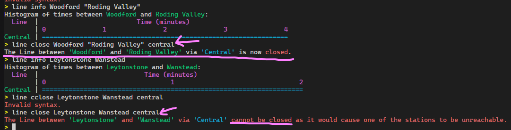 
Below is a visual representation of what I was explaining above.  
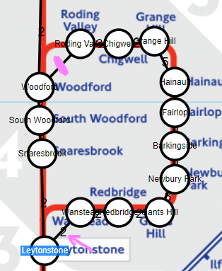

### Task 2b:
Task 2b asked us to show the impact of a closure one or multiple lines would have on the quickest journey between two stations.  
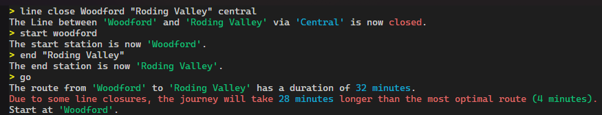

### Task 3:
Task 3 asked us to either come up with another algorithm to solve the pathfinding problem or create a visual representation of the graph. I had decided to do both, however the visual representation was not written in Python.  
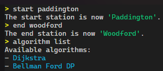 
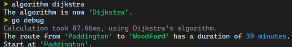 
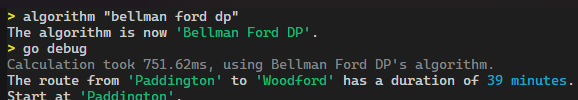

## Outcomes of Task 1, 2 and 3
###### (max 2 pages) [20 marks]

## Conclusion and critical discussion on the limitation of the work done
###### (max 1 page) [20 marks]
`Summary` Python is $H1T.

## Weekly log of progress, individual contribution toward the final outcome by each team member
###### (max 2 pages) [10 marks]

| Week | Progress |
| --- | --- |
| 23rd October | Started experimenting with data structures. |
| 30th October | Started building Dijkstra's algorithm. |
| 6th November | Completed building TS core web-app ([source](https://github.com/ReadieFur/GraphBuilder), private as of submission, [demo](https://readiefur.github.io/GraphBuilder/)). |
| 13th November | Converted TS web-app core to a Python CLI program and added task 2 specific properties. |
| 20th November | **1.** Completed task 1B to display a histogram timeline. **2.** Completed task 2A to allow line closures. **3.** Added Bellman Ford's dynamic programming algorithm. |

| Name | Allocation of marks agreed by team (0 - 100%) |
| --- | --- |
| Tristan Read | 100% |
